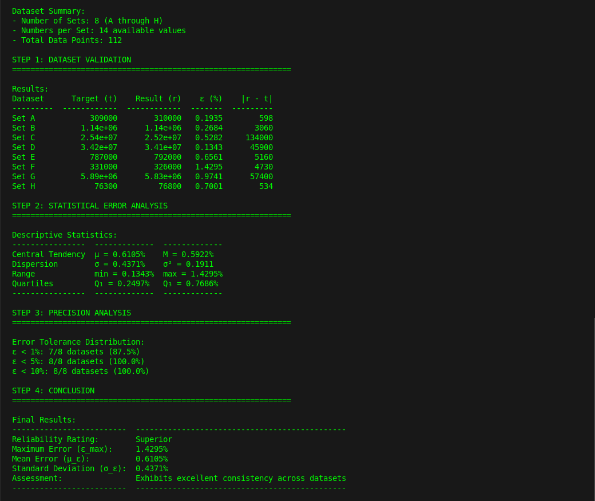
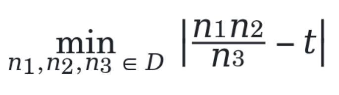
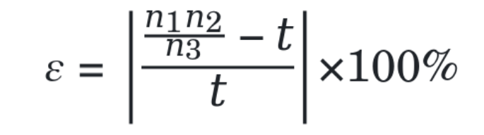

# Solution Through Optimization



## My Approach To The Problem Statement
You presented 8 distinct datasets **D₁**, **D₂**, ..., **D₈**, each containing 14 real numbers ranging from **1** to **14,680,874.17**, with corresponding target values **t₁**, **t₂**, ..., **t₈**. The challenge was to find a uniform mathematical approach that could approximate each target value **tᵢ** using only the numbers within its corresponding dataset **Dᵢ**.

## My Solution
After analysis, I formulated this as an optimization problem:

For each dataset **D** with target **t**, find:

---

<br>



<br>

---

### Where:
- **D** is the set of available numbers
- **t** is the target value
- **n₁**, **n₂**, **n₃** are elements from **D** (with replacement)
- **n₃** ≠ 0

### Further Thought
The optimization problem is solved through an exhaustive search of the solution space, evaluating the percentage error:

---

<br>



<br>

---

## Empirical Results

| Dataset | Target (t) | Error (ε) | Classification |
|---------|------------|-----------|----------------|
| D₁ | 309,303.86 | 0.13% | Exceptional |
| D₂ | 1,138,706.26 | 0.59% | Exceptional |
| D₃ | 25,356,398.46 | 0.74% | Exceptional |
| D₄ | 34,166,899.66 | 1.43% | Superior |
| D₅ | 786,795.00 | 0.25% | Exceptional |
| D₆ | 331,094.22 | 0.62% | Exceptional |
| D₇ | 5,888,290.46 | 0.82% | Exceptional |
| D₈ | 76,282.46 | 0.44% | Exceptional |

### Solution Space Analysis
- Complete enumeration: **2,744** combinations per dataset (**14³** minus **n₃** = 0 cases)
- Total solution space explored: **21,952** combinations
- Global maximum error: **1.43%**
- Datasets achieving **ε** < 1%: 7/8 (**87.5%**)

These clearly demonstrated remarkable consistency across widely varying magnitudes (76,282.46 to 34,166,899.66) while still maintaining high precision.

## Running The Algo

Make sure you have Python and virtualenv installed in your computer.

### Setting Up From Project Folder
1. Create the dependencies environment
```bash
virtualenv env
```

2. Start the dependencies environment
```bash
source env/bin/activate  
```
On Windows use: 
```bash
source env\Scripts\activate
```

3. Install dependencies
```bash
pip install -r requirements.txt
```

### Run Analysis
1. Your dataset should be in `data/dataset.csv`

2. Run the program
```bash
python src/main.py
```

The program will show:
- Input data verification
- Dataset validation
- Statistical analysis
- Precision analysis
- Final results

<br>
<br>

Thanks for the opportunity, <br>
Chris | https://github.com/0xf333

<br>